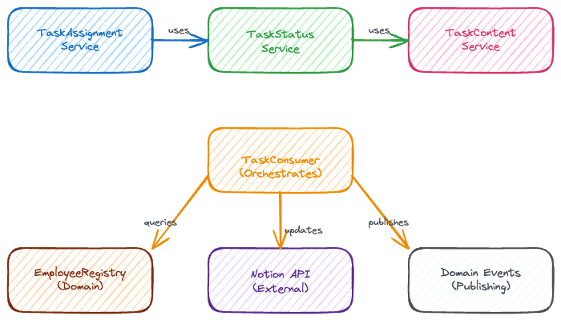

# AI Kanban System - Comprehensive Domain Model

This document provides a complete overview of all classes and their interactions in the AI Kanban system, illustrating how artificial employees intelligently process tasks through a sophisticated domain-driven architecture.

## Task Lifecycle & Event System

The system's event-driven foundation centers around the **NotionTask** domain event, which represents tasks pulled from the Notion database. Each **NotionTask** carries a **TaskStatus** enum (TODO, IN_PROGRESS, DONE) that drives the processing workflow. When tasks are successfully processed, **TaskProcessedEvent** is published, while failures trigger **TaskProcessingFailedEvent**.

The **TaskProcessingResult** value object encapsulates the outcome of employee task processing, containing success status, generated content, and any error messages. Employee lifecycle is tracked through **EmployeeActivatedEvent** and **EmployeeDeactivatedEvent**, providing visibility into when AI employees come online or go offline.

Infrastructure components like **TaskTracker** maintain persistent state of processed tasks to prevent duplicate processing, while **TaskMonitorService** continuously polls Notion for new tasks that meet processing criteria.

## Factory & Registry Management

The **EmployeeFactory** implements the Factory pattern to create fully configured artificial employees with their associated capabilities and behaviors. It provides specialized factory methods like `create_engineering_manager()`, `create_research_agent()`, and `create_documentation_specialist()`, each configuring employees with distinct personas and skill sets.

**ArtificialEmployee** serves as the aggregate root, containing business logic for task processing, capability validation, and workflow execution. Each employee maintains a collection of **EmployeeReaction** objects that map event conditions to specific workflows, enabling intelligent task routing based on content analysis.

The **EventCheck** abstract base class defines the capability validation system. Concrete implementations include **AssignmentCheck** (validates task assignment), **KeywordCheck** (validates content keywords), **StatusCheck** (validates task status), **ContentLengthCheck** (validates minimum content requirements), and **CompositeCheck** (combines multiple checks with AND/OR logic).

**EmployeeRegistry** manages the collection of active employees, providing lookup capabilities for task routing and employee management operations. **EmployeeWorkflowGraph** orchestrates complex multi-step AI operations using LangGraph, enabling sophisticated task processing beyond simple prompt-response patterns.

## Infrastructure & Repository Layer

The repository pattern separates domain logic from data persistence concerns. **MemoryRepository** provides the abstract base for in-memory storage operations, with **EmployeeMemoryRepository** as the concrete implementation storing employee memories and context.

**WorkflowState** represents the LangGraph state object passed through workflow nodes during task processing, maintaining context and intermediate results. **NotionMapper** handles the complex mapping between Notion API data structures and domain objects, encapsulating the external service integration logic.

The **Infrastructure.Repositories** module contains concrete implementations of domain repository interfaces, while **Domain.Repositories** defines the abstract interfaces that domain services depend upon. This separation enables clean dependency inversion and testability.

**RabbitMQClient** provides messaging infrastructure for asynchronous task processing, **TaskConsumer** orchestrates the message consumption pipeline, and **TaskMonitorService** continuously monitors Notion for new tasks requiring processing.

## Domain Services & Validation

The domain services layer encapsulates complex business operations that don't naturally belong to a single entity. **TaskAssignmentService** validates task assignments and ensures proper routing to qualified employees, providing detailed error reporting for assignment validation failures.

**TaskStatusService** manages task status transitions with proper business rules, ensuring valid state changes and maintaining data consistency. Methods like `transition_to_in_progress()` and `transition_to_done()` encapsulate the business logic for status transitions.

**TaskContentService** extracts and processes task content from Notion, handling the complexity of retrieving full task details, parsing content, and preparing it for AI processing. This service abstracts the intricacies of Notion's data model from the core domain logic.

**TaskConsumer** orchestrates the entire task processing pipeline, coordinating between all domain services, managing employee interactions, updating Notion with results, and publishing domain events for audit and monitoring purposes.

## Key Architectural Patterns

**Domain-Driven Design**: The system cleanly separates business logic from infrastructure concerns. Domain objects like `ArtificialEmployee`, `EmployeeReaction`, and `NotionTask` encapsulate business rules and invariants, while infrastructure handles persistence, external integrations, and technical concerns.

**Event-Driven Architecture**: All significant business operations publish domain events (`TaskProcessedEvent`, `EmployeeActivatedEvent`, etc.), enabling loose coupling, audit trails, and future extensibility. The event system provides complete visibility into system behavior and supports event sourcing patterns.

**Strategy Pattern**: The `EventCheck` system uses the strategy pattern with composite capabilities, making task capability validation highly flexible and extensible. Different check types can be combined using `CompositeCheck` to create sophisticated validation rules.

**Factory Pattern**: `EmployeeFactory` encapsulates the complex configuration of artificial employees, including their personas, event checks, workflow mappings, and memory repositories. This pattern makes it easy to create new employee types with different specializations.

**Repository Pattern**: Abstract repository interfaces in the domain layer are implemented by infrastructure components, enabling clean dependency inversion, testability, and the ability to swap persistence mechanisms without affecting domain logic.

**Workflow Orchestration**: `EmployeeWorkflowGraph` manages complex multi-step AI workflows using LangGraph, allowing employees to execute sophisticated task processing that includes memory management, context preservation, and multi-turn interactions with language models.

## System Integration & External Dependencies

**Notion API Integration**: The system integrates with Notion's API for task retrieval and status updates, with `NotionMapper` handling the complexity of data transformation between Notion's format and domain objects.

**RabbitMQ Messaging**: Asynchronous message processing ensures scalability and reliability, with `RabbitMQClient` managing connection handling, message publishing, and consumption patterns.

**LangGraph Workflows**: Integration with LangGraph enables sophisticated AI workflow orchestration, supporting conditional branching, memory management, and complex multi-step reasoning processes.

**Claude LLM Integration**: The system leverages Anthropic's Claude for natural language processing, with workflows designed to maintain context and persona consistency across interactions.

## Scalability & Extensibility

The architecture supports horizontal scaling through its event-driven, message-based design. New employee types can be easily added through the factory pattern, while new capability checks can be implemented by extending the `EventCheck` base class.

The repository pattern enables multiple persistence strategies, while the domain services pattern allows for complex business logic that can evolve independently of the underlying technical infrastructure.

The system's treating artificial employees as first-class domain entities creates a flexible foundation for AI-powered task management that can easily accommodate new employee types, capabilities, and workflows as business requirements evolve.